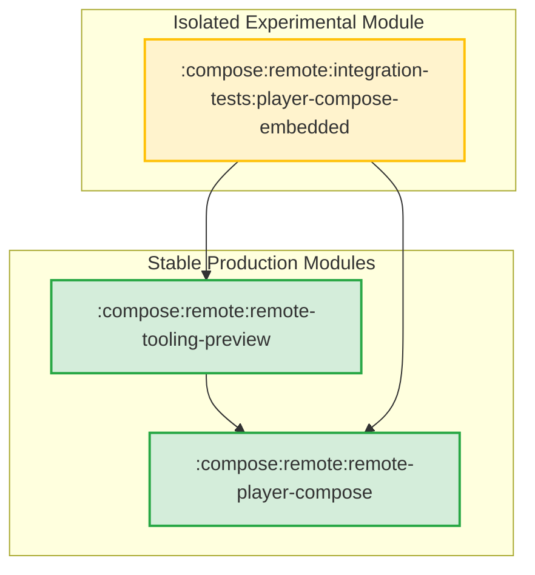
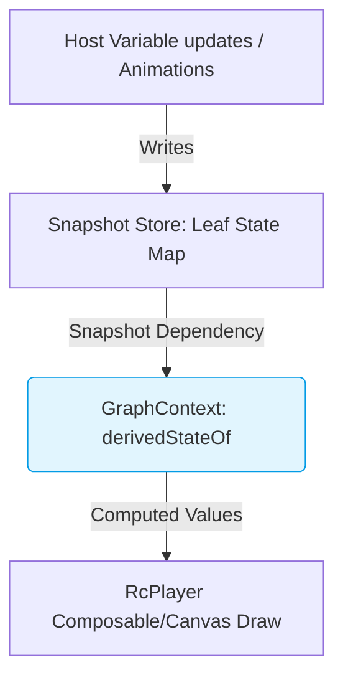

# Embedded Compose Player Integration & Testing Module

This directory contains the integration tests, Wear previews, and the experimental Compose embedded player (`RcPlayer`).

To maintain the architectural integrity and stability of the main production libraries, the experimental embedded player has been isolated here, decoupled from the compile-time classpath of production modules.

---

## Architecture Overview

The experimental player utilizes reflection to read package-private and private APIs inside `remote-core` so that the core module remains pristine and matching upstream. To prevent this experimental reflection-based code from polluting production builds and stable modules, we isolate the player and its preview helpers in this test integration module:

---

## Technical Analysis: Embedded Player (player-compose-embedded) vs View Player (remote-player-compose)

Below is a detailed comparison of the pure-Compose embedded player (`player-compose-embedded`) and the View Canvas-based players (`remote-player-compose` and `remote-player-view`).

### 1. Canvas-Based Drawing vs. Emitting Compose UI Nodes

*   **View Player:** Paints the entire remote document tree onto a single Android `Canvas` (via an `AndroidView` or a global Compose `Canvas`). The document layout is computed imperatively on the client by the core engine, giving the player no visibility into individual component nodes at the Android/Compose UI level. A monolithic paint pass runs via `document.paint(paintContext)`.
*   **Embedded Player:** Translates the remote document's layout component tree into a tree of native Compose UI Nodes (e.g. `Box`, `Column`, `Row`, `Text`). It delegates layout measurement and placement to the native Compose layout engine (e.g., mapping `BoxLayout` to Compose `Box` and `ColumnLayout` to Compose `Column`). Component-specific drawing operations are executed inside localized `drawWithContent { ... }` modifiers or dedicated `Canvas` elements, enabling Compose to cache vector rendering and draw layers independently.

### 2. State Evaluation and Reactive Tracking

*   **View Player:** State variables are stored in basic, non-reactive maps inside the core engine's `RemoteComposeState` (e.g., primitive `Float` or `Int` maps). Reactivity is driven by an active frame loop (`Choreographer` in Views, `withFrameNanos` in Compose). If animations are enabled, the loop ticks continuously and forces a full-document invalidate and repaint, re-running all variable computations imperatively every frame.
*   **Embedded Player:** Backed by `SnapshotRemoteComposeState` which uses Compose's `SnapshotStateMap`s, making Compose the single source of truth for the variables. Composables and modifiers read state using reactive helpers (`rememberRemoteIntAsState(id)`, etc.). Reading these states automatically registers a snapshot dependency; when a variable updates, only the specific nodes and composables reading it are invalidated and recomposed/redrawn. The frame loop suspends when the document is static.

### 3. RPN Expression Evaluation

*   **AST Translation:** `rememberRemoteExpression` translates the RPN bytecode in `mSrcValue` into a lazy AST tree of `RemoteOp` nodes (e.g., `AddOp`, `LerpOp`, `CubicOp`) evaluated inside a `derivedStateOf { tree.eval() }` block.
*   **Imperative Fallback:** If an expression contains side-effecting or stateful opcodes (e.g., registers, random number generators, or array operations), it falls back to an `ImperativeRpnOp` that delegates to the core `AnimatedFloatExpression` interpreter, ensuring functional parity.
*   **Animations:** Animation-bearing expressions (e.g. appearance target + easing specs) are parsed and translated to Compose-native `Animatable` instances. Animating to targets is done via `Animatable.animateTo`, utilizing Compose's native animation engine rather than the core player's manual frame-delta math.

### 4. Reactive Dependency Resolution via GraphContext

`GraphContext` bridges the core engine's non-reactive operation evaluation with Compose's reactive snapshot engine:

*   **Read Interception:** When a computed variable is read, `GraphContext` looks up the corresponding operation and evaluates it inside a `derivedStateOf` block, automatically tracking its dependencies.
*   **Write Interception:** During `derivedStateOf` evaluation, writes (such as `loadFloat`) are captured in a thread-local sink instead of mutating the main snapshot store. This prevents illegal snapshot writes during read phases and preserves evaluation purity.

### 5. Layout and Modifier Mapping

Common layouts and modifiers are mapped to their Compose counterparts, adapting behaviors when needed:

*   **BoxLayout:** Translates directly to Compose `Box` using content alignment mapped from horizontal and vertical integer constants.
*   **ColumnLayout / RowLayout:** Maps to Compose `Column`/`Row` with main-axis alignment (`Arrangement`) and cross-axis alignment (`Alignment`) mapped from remote layout properties.
*   **Collapsible Layouts (`CollapsibleColumnLayout` / `CollapsibleRowLayout`):** Expressed using custom Compose `Layout` measuring blocks. It measures children and excludes placing those that overflow the layout constraints.
*   **FitBoxLayout:** Custom layout measuring children unbounded. It places only the first child that fits within the parent's constraints, matching the core's alternative-based layout logic.
*   **CanvasLayout:** Renders as a `Box` wrapping a Compose `Canvas` executing draw instructions extracted from the nested `CanvasContent` node.
*   **Modifiers:** Evaluated via `ComponentModifiers.toModifier()` (e.g., `PaddingModifierOperation` -> `Modifier.padding`, `OffsetModifierOperation` -> `Modifier.offset` converting pixel values to dp).

### 6. Code Reuse and Duplication

*   **Reused Core Logic:** The embedded player heavily reuses parser, decoder, and data structure elements from `remote-core` and `remote-player-compose` utilities (e.g. `CoreDocument`, `AnimatedFloatExpression`, `PathUtils.kt`).
*   **Duplicated Concerns:** `RcPlayerPaint.kt` implements paint state handling (`ComposeLocalPaint` and `updatePaintFromBundle`) which overlaps with `ComposePaintContext` and `ComposePaintChanges` in the legacy player. This exists because the legacy player builds a low-level `Paint` object, whereas the embedded player uses a lightweight Kotlin paint state to interact with Compose `DrawScope` APIs.
*   **Infrastructure Needs:** The embedded player relies on reflection (`CoreReflection.kt`) to extract package-private fields from core operations (e.g., `ClipPath.clipPathId`, `DrawTextOnPath.pathId`). Adding public read-only accessors or exposing these fields in the `remote-core` API would eliminate this reflection code and clean up the embedded player's codebase.

### 7. Deviations and Breaks from Compose UI Defaults

To maintain behavior parity with the remote-core rendering, the embedded player deviates from Compose UI defaults in several areas:

1.  **Collapsible Layout Overrides:** Standard Compose columns/rows do not drop children that overflow. Custom layouts are written to implement this behavior.
2.  **FitBox Selection:** A standard Compose `Box` overlaps and displays all children. `RcPlayerFitBoxLayout` overrides this to hide all but the first child that fits.
3.  **Offset Densities:** Remote coordinates are pixel-based. Applying them to `Modifier.offset` requires explicitly dividing coordinates by density to get DP values.
4.  **Frame Rate Controls:** Desired frame rates (`DOC_DESIRED_FPS`) are applied as platform hints using `Modifier.preferredFrameRate(desiredFps)` rather than throttling frame ticks manually.

### 8. Accessibility (A11y) and Interactive Richness

Emitting Compose UI Nodes restores standard Android framework integrations that are lost in a canvas-based approach:

| Capability | View-Based Player (`remote-player-view`) | Embedded Player (`player-compose-embedded`) |
| :--- | :--- | :--- |
| **Accessibility (A11y)** | Requires a custom, complex `ExploreByTouchHelper` to manually compute virtual node bounds and expose them to TalkBack. | Emits native Compose UI nodes, granting screen readers, TalkBack, and touch exploration full access automatically. |
| **D-pad & Focus** | Focus traversal (e.g., keyboard, TV remote) must be handled manually. | Standard focus management handles movement across elements based on spatial layout. |
| **Overscroll & Scrolling** | Scroll bounds and overscroll stretch animations are simulated or lost. | Standard Compose scrolling (`verticalScroll`, etc.) provides native platform overscroll physics and integrates with parent nested-scrolling. |
| **Text Operations** | No native support for text selection, cursor handles, magnification, or copy/paste. | Native Compose `Text` integration supports text selection handles, copy-paste, and IME features. |
| **Layout Inspection** | Appears as a single block in the Layout Inspector. | The full layout tree and hierarchy can be inspected in the Android Studio Layout Inspector. |
| **Autofill** | Input fields are invisible to Autofill services. | Native form fields can be autofilled. |
| **Right-to-Left (RTL)** | Coordinates and layout mirroring must be manually computed. | Native Compose layout handles RTL locale mirroring automatically. |
