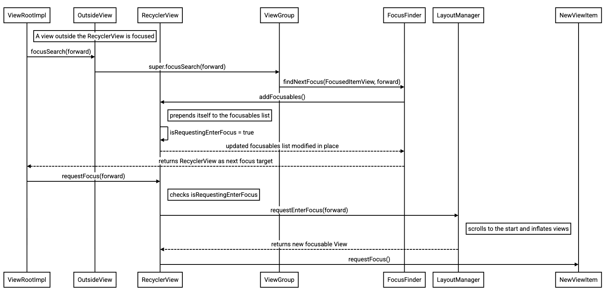
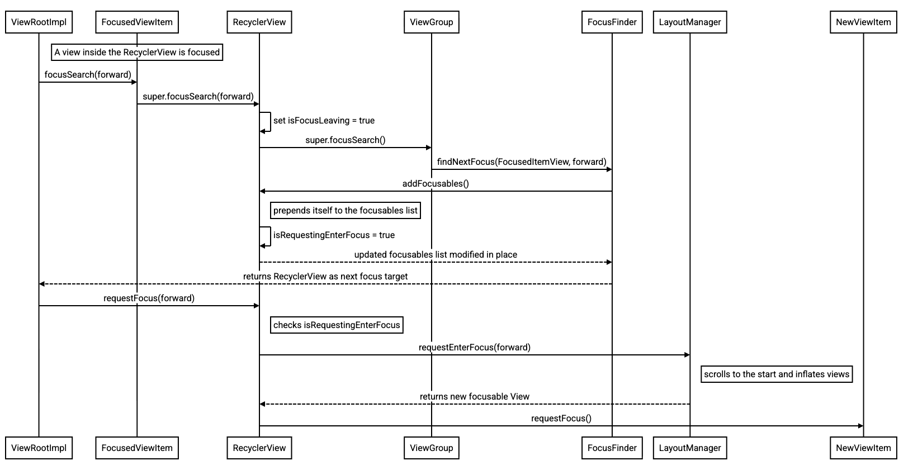

# Fixing looping one-dimensional tab navigation in RecyclerView (b/406190006)

This document outlines the design and implementation for fixing one-dimensional focus navigation loops in `RecyclerView`.

Tab and shift-tab perform one-dimensional focus navigation across the screen hierarchy. To ensure accessible navigation, all focusable items within a list should be reachable, regardless of current scroll position or attachment state.

When tab navigation reaches the end of a list and loops around, or when focus enters the `RecyclerView` externally, it must scroll to and inflate items at the proper boundary (start or end) rather than focusing only currently rendered views.

## Required Test Cases

```
Preconditions:
  * RecyclerView has focusable children
  * Other focusable items present on screen
  * Initial Focus: Item before RecyclerView
  * Initial RecyclerView State: Scrolled to middle
When: Press Tab (Forward Navigation)
Result:
  * Scroll: To top
  * Focus: First focusable item in adapter
```

```
Preconditions:
  * RecyclerView has focusable children
  * Other focusable items present on screen
  * Initial Focus: Item after RecyclerView
  * Initial RecyclerView State: Scrolled to middle
When: Press Shift-Tab (Backward Navigation)
Result:
  * Scroll: To bottom
  * Focus: Last focusable item in adapter
```

```
Preconditions:
  * RecyclerView has focusable children (items 0-2 unfocusable, item 3 focusable)
  * Initial Focus: Last item inside RecyclerView
When: Press Tab (Forward Looping)
Result:
  * Scroll: To top
  * Focus: Item 3 (First focusable child)
```

```
Preconditions:
  * RecyclerView has only 1 focusable item
  * Initial Focus: Only focusable item inside RecyclerView
  * No surrounding focusable views
When: Press Tab / Shift-Tab
Result:
  * Focus: Loops back to the same single item
```

```
Preconditions:
  * RecyclerView contains no focusable items, but RecyclerView is focusable (as
    it is by default)
  * Initial Focus: Item before RecyclerView
When: Press Tab
Result:
  * Focus: RecyclerView itself
```

```
Preconditions:
  * RecyclerView contains no focusable items, and RecyclerView is not focusable
  * Initial Focus: Item before RecyclerView
When: Press Tab
Result:
  * Focus: Item after RecyclerView
```

## Implementation Architecture & Mechanism

RecyclerView previously didn’t have a concept of focus “entering” the RecyclerView, as this isn’t something built-in to the View focus system. To achieve this behavior, we will track this information using the available signals during the focus search and requestFocus codepaths, detailed below in the communication sequence diagrams.

To handle the case where the currently focused View is inside the RecyclerView, the new logic starts when we are about to make the super.focusSearch call inside RecyclerView.focusSearch (which has bubbled up from the currently focused View). Before we make the super.focusSearch call, we flip a mIsFocusLeaving flag to true, which allows us to know that we are in that state when the super.focusSearch bubbles to the root, and we get a re-entrant call to addFocusables where we check the mIsFocusLeaving flag. We will clear the mIsFocusLeaving flag back to false before returning the result from the super.focusSearch call.

To handle the case where the currently focused View is outside the RecyclerView, the new logic starts directly in the addFocusables call, where we know that focus is currently elsewhere.

In both of these cases, where we are in addFocusables and we know focus is entering, we will flip a mIsExpectingEnterFocusRequest flag to true, and schedule a post to clear the flag back to false. Because it is a valid contract to call focusSearch without actually moving focus, and it is also valid to call requestFocus without previously calling focusSearch, we don’t have another mechanism to associate a focusSearch call followed by a requestFocus without assuming that a RecyclerView.focusSearch which returns the RecyclerView followed by RecyclerView.requestFocus within the same frame should trigger re-entering logic. This matches the built-in ViewRootImpl logic for moving focus.

We will also manually clear the mIsExpectingEnterFocusRequest flag and clear the posted runnable when we see the onRequestFocusInDescendants, onDetachedFromWindow, requestFocus, which reduces the chance that a requestFocus that is unrelated to the focusSearch erroneously changes a requestFocus behavior.

### Sequence diagram for when focus is outside the RecyclerView



### Sequence diagram for when focus is inside the RecyclerView



