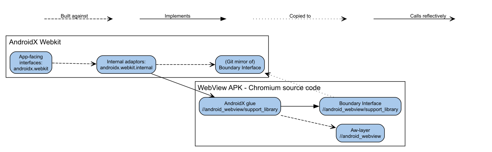

# Jetpack Webkit Contributor Guide

The `androidx.webkit` library is a client library that exposes functionality
from the installed system WebView without the need for Android Framework API
updates.

For contributors, this means that any new features will first be developed in
the [Chromium WebView](https://cs.chromium.org/chromium/src/android_webview/)
repository, and then exposed in `androidx.webkit` afterwards.

## Code Location Overview



The code for Jetpack Webkit APIs live across the Chromium and
AndroidX git repositories, and is split into 3 conceptual parts:

* The feature implementation itself, which is implemented in the
  [//android\_webview](https://source.chromium.org/chromium/chromium/src/+/main:android_webview/)
  directory in Chromium, along with feature tests.
  * Note that the implementation in WebView often involves calling code that
    exists elsewhere in the Chromium repository.
* Boundary interfaces and adapter code to facilitate communication with the
  client library code, which lives in the
  [//android\_webview/support\_library](http://android_webview/support_library/)
  directory
* The
  [`androidx.webkit`](https://cs.android.com/androidx/platform/frameworks/support/+/androidx-main:webkit/)
  library itself, which contains both client app adapter code and public
  interfaces.

The communication between the client library, which is compiled into the client
apps, and the WebView implementation, which is distributed as a separate
package, is facilitated by copying the boundary interfaces into the client
library and using reflection to call the relevant methods through the use of
[Proxy](https://docs.oracle.com/javase/8/docs/api/java/lang/reflect/Proxy.html)
and
[InvocationHandler](https://docs.oracle.com/javase/8/docs/api/java/lang/reflect/InvocationHandler.html)
classes.

## How to add a new feature

To add a new feature to the `androidx.webkit` library, you should first [file a
feature
request](https://issuetracker.google.com/issues/new?component=460423&type=feature_request&priority=p2),
and use this as a way to discuss your feature with the WebView team. You should
be prepared to write a design document as part of this process, and explain the
value the new feature will bring. Be aware that the proposed API must adhere to
the [Android API
guidelines](https://android.googlesource.com/platform/developers/docs/+/refs/heads/master/api-guidelines/index.md).
This design doc will be reviewed by the WebView team to ensure the API is
appropriate to be added and follows the API guidelines.

Once the design document has been approved, you can then start development,
which involves the following 3 steps, that are further outlined in the
following sections:

1. First, you must implement the new feature in Chromium WebView. See the
   [Chromium Contributor
   Guide](https://chromium.googlesource.com/chromium/src/+/lkgr/docs/contributing.md)
   and the [Chromium WebView Build
   Guide](https://chromium.googlesource.com/chromium/src/+/HEAD/android_webview/docs/quick-start.md)
   for further instructions.
   1. Once the Chromium implementation is done and tested, you will need to
      create an appropriate set of [boundary
      interfaces](https://source.chromium.org/chromium/chromium/src/+/main:android_webview/support_library/),
      to expose the feature to the client library. This mechanism is described
      in further detail below.
2. When both implementation and boundary interfaces have landed in the Chromium
   repository, the boundary interfaces will be synchronized to the [AndroidX
   repository](https://cs.android.com/androidx/platform/frameworks/support),
   making them available for development. See the [AndroidX Contributor
   Guide](https://chromium.googlesource.com/aosp/platform/frameworks/support/+/refs/heads/androidx-main/README.md)
   for how to get started. Code for the `androidx.webkit` library lives in the
   [webkit folder](https://cs.android.com/androidx/platform/frameworks/support/+/androidx-main:webkit/).
3. Once the API implementation is done in AndroidX, you must mark the tracking
   feature request as “Fixed”, at which point the [Android API
   Council](https://android.googlesource.com/platform/developers/docs/+/refs/heads/master/api-guidelines/index.md)
   will give the implemented API a final review. The council may file bugs with
   requests for changes, which must be addressed before the API can be released
   in a stable library release. Having a well-written and reviewed design
   document before implementation starts can help reduce the risk of issues at
   this stage.

## Implementing a feature in Chromium

All WebView APIs are implemented as public methods on the [Chromium WebView
implementation](https://crsrc.org/c/android_webview/java/src/org/chromium/android_webview/).
These Java classes implement both the `android.webkit` and `androidx.webkit`
packages. Tests for features are implemented as instrumentation tests in the
[`javatest`
folder](https://crsrc.org/c/android_webview/javatests/src/org/chromium/android_webview/test/).

## Implementing the Chromium Boundary Interface

WebView features are exposed to the `androidx.webkit` library through a series
of [Boundary
Interfaces](https://crsrc.org/c/android_webview/support_library/boundary_interfaces/;l=1?q=path:boundary_in&sq=&ss=chromium%2Fchromium%2Fsrc).
These interfaces are shared with the AndroidX library code, and allows the
client library to communicate with the Chromium WebView implementation via
reflection.

**Note:** Because the system WebView and the application code that uses the
`androidx.webkit` library are loaded by separate classloaders by the Android
Runtime, the boundary interfaces can only use classes that are part of the
Android Framework API or Java Language for parameters and return types. Custom
types are represented by the
[InvocationHandler](https://docs.oracle.com/javase/8/docs/api/java/lang/reflect/InvocationHandler.html)
interface, which is used to represent objects that implement a boundary
interface.

In order to expose your feature to the AndroidX library, you must:

* Add the new method(s) to the [relevant boundary
  interface](https://source.chromium.org/chromium/chromium/src/+/main:android_webview/support_library/boundary_interfaces/src/org/chromium/support_lib_boundary/).
* Add a new [feature
  constant](https://source.chromium.org/chromium/chromium/src/+/main:android_webview/support_library/boundary_interfaces/src/org/chromium/support_lib_boundary/util/Features.java)
  to represent the new API surface.
* Add your feature constant to the [set of supported
  features](https://source.chromium.org/chromium/chromium/src/+/main:android_webview/support_library/java/src/org/chromium/support_lib_glue/SupportLibWebViewChromiumFactory.java?q=symbol%3A%5Cborg.chromium.support_lib_glue.SupportLibWebViewChromiumFactory.sWebViewSupportedFeatures%5Cb%20case%3Ayes),
  with “`+ Features.DEV_SUFFIX”` appended to it. See below for a discussion of
  what this achieves.
* Extend the
  [ApiCall](https://source.chromium.org/chromium/chromium/src/+/main:android_webview/support_library/java/src/org/chromium/support_lib_glue/SupportLibWebViewChromiumFactory.java?q=symbol%3A%5Cborg.chromium.support_lib_glue.SupportLibWebViewChromiumFactory.ApiCall%5Cb%20case%3Ayes)
  enum with new values for your methods, and update the corresponding enum
  entry in
  [enums.xml](https://source.chromium.org/chromium/chromium/src/+/main:tools/metrics/histograms/metadata/android/enums.xml)
* Add adapter implementation(s) to the relevant [boundary interface
  adapter](https://crsrc.org/c/android_webview/support_library/java/src/org/chromium/support_lib_glue/).
  Make sure to add trace events and metrics instrumentation.

If your API calls for callback objects that the application must implement, the
boundary interface for those callbacks must extend
[FeatureFlagHolderBoundaryInterface](https://source.chromium.org/chromium/chromium/src/+/main:android_webview/support_library/boundary_interfaces/src/org/chromium/support_lib_boundary/FeatureFlagHolderBoundaryInterface.java).
This ensures that any future extensions to the boundary interface can be
feature checked by WebView before invoking the callback methods. While it is
possible to add new features to a callback interface if this step was
overlooked, the [solution is not
pretty](https://source.chromium.org/chromium/chromium/src/+/main:android_webview/support_library/java/src/org/chromium/support_lib_glue/SupportLibProfile.java?q=symbol%3A%5Cborg.chromium.support_lib_glue.SupportLibProfile.createOperationCallback%5Cb%20case%3Ayes).

If you want to know more about the feature checking mechanism, it is described
[here](docs/feature_checking.md).

### What do feature constants and the `DEV_SUFFIX` do?

Because WebView is installed separately from the applications that use it and
is frequently updated, applications that use the `androidx.webkit` client
library must have a method to determine what features the currently installed
version of WebView supports. This is achieved by WebView exposing an [array of
supported
features](https://source.chromium.org/chromium/chromium/src/+/main:android_webview/support_library/java/src/org/chromium/support_lib_glue/SupportLibWebViewChromiumFactory.java?q=symbol%3A%5Cborg.chromium.support_lib_glue.SupportLibWebViewChromiumFactory.sWebViewSupportedFeatures%5Cb%20case%3Ayes)
which is read through reflection and allows the client library to determine if
a given feature can be used or not. A feature string constant added to this
array signals that it is safe to call a certain set of methods through
reflection.

During feature development, we need a mechanism to enable a feature for testing
purposes, while still maintaining the ability to make changes to the boundary
interface. Instead of creating new feature constants for each change to the
boundary interfaces, a feature constant can be added to the array of supported
features along with the `Features.DEV_SUFFIX` appended. This special suffix is
understood by the feature detection implementation, and enables the feature if
the application that uses the client library is running on a `userdebug` build
of Android, which is the case for the AndroidX test runners.   This way, new
features can be added and tested by the CI system, without being available on
production devices.

Once the boundary interfaces are ready for stable release, the `DEV_SUFFIX` can
be removed from the feature constant in the supported features array. At this
point, the feature will be available for production use in the WebView version
that contains this change.

#### Feature checking callback interfaces

The method of feature detection above allows the AndroidX library to detect
which features the installed WebView implementation supports. However, for any
classes created by the application, most commonly callbacks, we need a similar
mechanism to let the installed WebView detect what features a given callback
supports.

This is achieved by having any boundary interface that represents an
app-implemented class inherit from `FeatureFlagHolderBoundaryInterface`. By
doing this, the interface will expose a method that returns an array of feature
constants, which can be used by WebView to check what methods the boundary
interface supports. See [this
example](https://source.chromium.org/chromium/chromium/src/+/main:android_webview/support_library/java/src/org/chromium/support_lib_glue/SupportLibWebMessageListenerAdapter.java)
of how that is used by WebView, and the [corresponding implementation in
AndroidX](https://cs.android.com/androidx/platform/frameworks/support/+/androidx-main:webkit/webkit/src/main/java/androidx/webkit/internal/WebMessageListenerAdapter.java).

It is critical that this inheritance is established when the boundary interface
is created, since any subsequent changes to the boundary interface otherwise
won’t be able to call the method on objects received from earlier versions of
AndroidX.  The first version of a callback interface does not need to return
any values in the array, as an empty array is a signal of the base version.
Features added to the array of supported features does not need to have the
`DEV_SUFFIX` applied.

### Rolling the boundary interfaces

After changes are made to the boundary interfaces, the AndroidX repository must
be updated to use the latest version.

***note
**Note:** Googlers can run the
`clank/bin/roll_boundary_interfaces.py` script from a checkout of Chromium,
while external contributors should ask their Google liaison (usually the person
who performs the code review for the feature) to perform this step.
***

Hint: For local development before the interfaces have been rolled, the
boundary interface changes can be copied into the
`external/webview_support_interfaces` folder found in the root of the
`androidx-main` checkout.

**Note:** The new version of the boundary interfaces must still compile when
matched with the current head of the `androidx-main` branch. In particular,
this means:

- Any new methods on existing callback interfaces must have a default
  implementation, so the corresponding implementation in AndroidX still
  correctly implements the interface.
- Removing methods on interfaces provided by WebView to AndroidX can only be
  done once the code that calls those methods in AndroidX has been removed.

## Implementing the Jetpack API

In the checkout of Jetpack, the APIs live in the `frameworks/support` folder.
All paths and commands in this document are relative to this folder, unless
otherwise noted.

The WebView public API lives in `webkit/webkit/src/main/java/androidx/webkit/`,
while boundary interfaces are implemented by adapters in
`webkit/webkit/src/main/java/androidx/webkit/internal/`.

Any `public` classes, methods, or variables added to the public API package
automatically becomes part of the next released version of the
`androidx.webkit` library. To prevent this, new code must have the
`@RestrictTo(RestrictTo.Scope.LIBRARY_GROUP)` annotation applied during
development. This hides the API from public documentation, and ensures that the
API can be made public deliberately once it is fully developed.

All APIs must have appropriate instrumentation tests added to the [test
suite](http://webkit/integration-tests/instrumentation/src/androidTest/java/androidx/webkit/),
and should additionally have a demo activity added to the [test
app](http://webkit/integration-tests/testapp/) to showcase how to use the API.
Note that the test app is written in Kotlin, as a way to check that new APIs
interoperate well when used in a Kotlin app.

### Implementing feature checking

To support the feature check mechanism, a new feature string constant must be
added to
[WebViewFeature](https://cs.android.com/androidx/platform/frameworks/support/+/androidx-main:webkit/webkit/src/main/java/androidx/webkit/WebViewFeature.java),
and this constant must be mapped to the corresponding feature constant from the
boundary interfaces in
[WebViewFeatureInternal](https://cs.android.com/androidx/platform/frameworks/support/+/androidx-main:webkit/webkit/src/main/java/androidx/webkit/internal/WebViewFeatureInternal.java).
These can then be used to annotate new methods or classes, and assert that the
feature is supported with an appropriate error message:

```java
@RequiresFeature(name = WebViewFeature.NEW_FEATURE_NAME,
        enforcement = "androidx.webkit.WebViewFeature#isFeatureSupported")
public void newFeature(...) {
    final ApiFeature.NoFramework feature = WebViewFeatureInternal.NEW_FEATURE;
    if (feature.isSupportedByWebView()) {
        // Call appropriate adapter methods here...
    } else {
        throw WebViewFeatureInternal.getUnsupportedOperationException();
    }
}
```

The feature constant in WebViewFeature must also be annotated with a
`@RestrictTo` annotation, since it is part of the public API.

### Developing in Android Studio

The AndroidX project bundles a preconfigured installation of Android Studio.
This can be used by running

```shell
./studiow :webkit:
```

Which will open it with just the `webkit` library loaded.  This project
configuration is also set up to provide correct code formatting and lint rules
for the project.

### Local testing

During local testing, it is very important to ensure that the version of
WebView installed on the test device implements the feature to be tested.  It
is recommended to use `userdebug` android devices such as emulators for
testing, since this makes features with `DEV_SUFFIX` visible to the client
library.

See the Chromium WebView developer guide for instructions on how to install
local builds of WebView.

### Preparing the feature for release, and getting API Review approval

Once the API implementation is finished, the API can be released.  This is done
by submitting a CL where all the previously added `@RestrictTo` annotations are
removed.  In the same CL, you must run

```shell
./gradlew webkit:webkit:updateApi
```

Which will output changes to `webkit/webkit/api/current.txt` and
`webkit/webkit/api/restricted_current.txt`. These changes must be part of the
same CL that removes the `@RestrictTo` annotations.

This CL should additionally

* Have a `Fixes: <bug_id>` footer line, which will automatically mark the
  feature request as fixed in the bug tracker once the change lands.
* Have a `Relnote: “release notes for the new feature”` footer containing the
  text that should be part of the [library release
  notes](https://developer.android.com/jetpack/androidx/releases/webkit). See
  the [guide on how to write release notes](docs/release_notes.md).

In addition to normal code review, this CL must also get API review approval.
This review is performed by a single member of the Android API Council, and
should capture most issues with the [Android API
Guidelines](https://android.googlesource.com/platform/developers/docs/+/refs/heads/master/api-guidelines/index.md).
The API reviewer will also pay particular attention to the JavaDoc for the API.

After the CL lands, and the tracking bug is marked as fixed, the API change
will then be reviewed by the API Council in an in-depth review. This review may
result in issues being filed, which must be addressed before the API can be
part of a non-alpha library release. For this reason, it is recommended to mark
the tracking bug as fixed as soon as possible.

## Release process

Your feature is part of both the Chromium and AndroidX release processes.

### Chromium

The Chromium release schedule can be found at
[https://chromiumdash.appspot.com/schedule](https://chromiumdash.appspot.com/schedule).
Any changes for a specific version must be submitted before the listed Branch
date.  You can check which version your changes are part of on the [Commits
page](https://chromiumdash.appspot.com/commits?platform=Webview).

### AndroidX

AndroidX libraries have a release window every 2 weeks, in which the library
owner can choose to schedule a release. The library goes through a cycle of
`-alpha`, `-beta`, and `-rc` releases before the final stable release. Any API
changes must have landed and been released as part of an `-alpha` release in
order to be part of the subsequent cycle towards a stable release.

For each library version, there will typically be multiple `-alpha` releases
before the cut to `-beta` and beyond.

The library goes through the release cycle on a quarterly basis.

